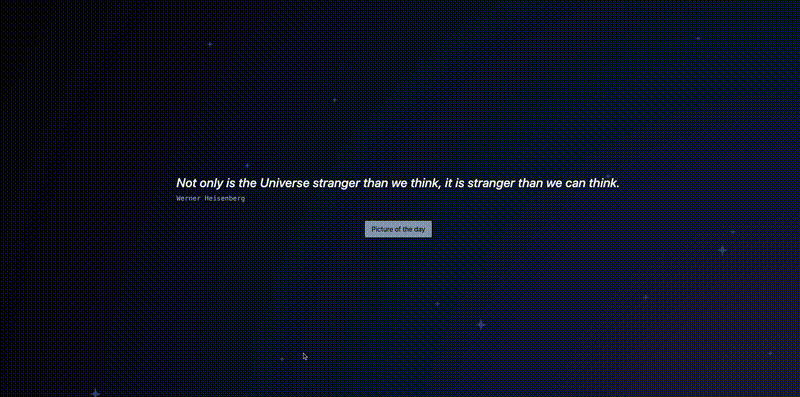

# My Project

# 🌌 The Big Picture

**NASA's Picture of the Day – Reimagined**

## 🚀 Overview

**The Big Picture** improves the usability and experience of NASA’s Picture of the Day portal. We’ve redesigned the interface to be more engaging, added new features like favoriting, and laid the groundwork for educational enhancements.

## 🧠 Problem Statement

NASA's original Picture of the Day site lacks modern UI/UX and has limited interactive features. We’re addressing this by creating a more enjoyable and accessible experience for users of all ages.

## ✅ Our Solution

- Redesigned user interface for improved navigation and accessibility  
- New features like image favoriting and extended information  
- Built-in user authentication and persistent favorites  
- Mobile-responsive and tested across devices  

## 🔧 MVP Scope

- New and improved UI using Tailwind CSS  
- React frontend with routing  
- Functional login/authentication flow  
- Backend with Express and MongoDB  
- Basic testing coverage  

## 🧩 Stretch Goals

- Quiz game based on image metadata  
- Integration of additional NASA APIs  
- User dashboard with saved favorites  

## 🛠️ Tech Stack

- **Frontend**: React, Tailwind CSS, React Router  
- **Backend**: Node.js, Express  
- **Database**: MongoDB, Mongoose  
- **Auth & Security**: Bcrypt, JWT  
- **Testing**: Jest, React Testing Library  

## 🔥 Challenges Tackled

- Integrating Tailwind into a custom React build  
- Secure authentication and session handling  
- Seamless communication between frontend and backend  
- Database modeling for favorites and users  

## 👥 Team Responsibilities

| Team Member | Responsibilities             |
|-------------|------------------------------|
| **Yuri**    | Frontend, React.             |
| **Victor**  | Server, APIs, Testing        |
| **Joao**    | React, Tailwind              |